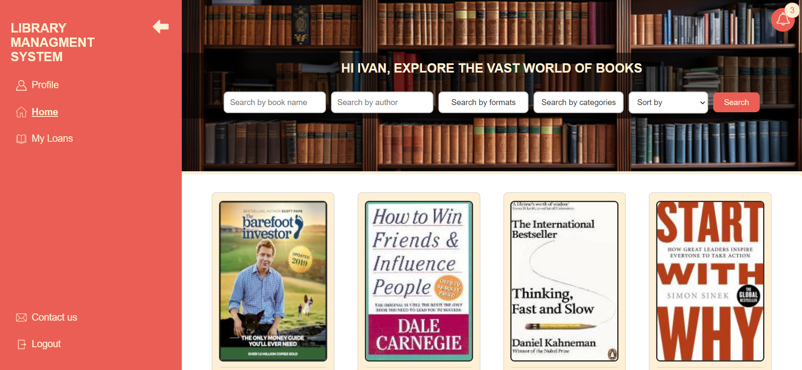
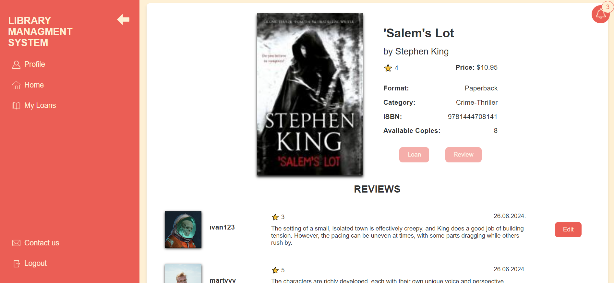
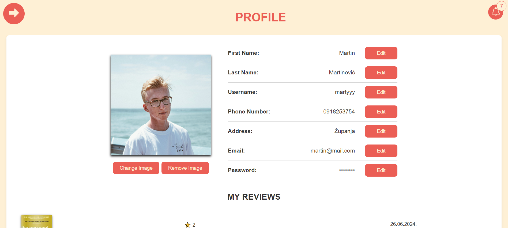
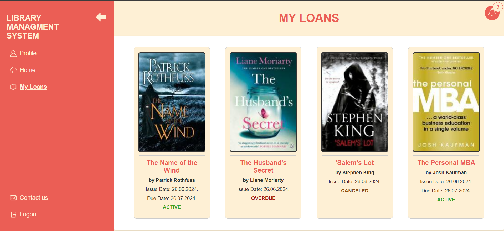
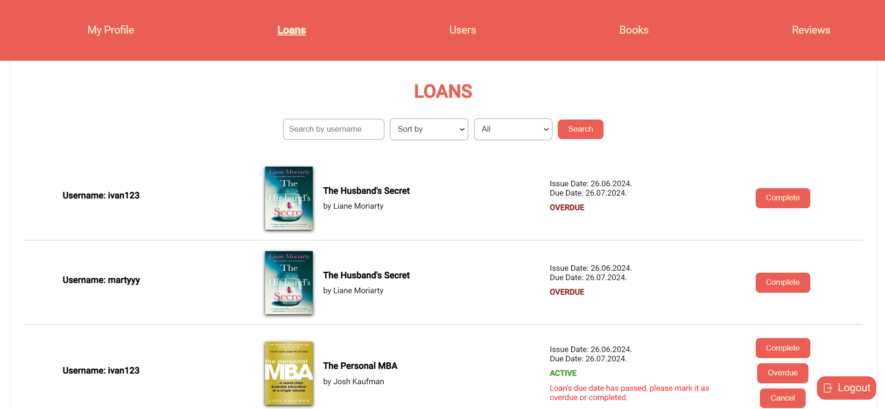

<div id="top"></div>
<div align="center">
<h3 align="center">Library Management System</h3>

  <p align="center">
    Full-stack application that allows users to easily search, borrow, and review books from a digital library.
  </p>
</div>

<!-- TABLE OF CONTENTS -->
<details>
  <summary>Table of Contents</summary>
  <ol>
    <li>
      <a href="#about-the-project">About The Project</a>
      <ul>
        <li><a href="#built-with">Built With</a></li>
      </ul>
    </li>
    <li>
      <a href="#getting-started">Getting Started</a>
      <ul>
        <li><a href="#installation">Installation</a></li>
      </ul>
    </li>
  </ol>
</details>

<!-- ABOUT THE PROJECT -->

## About The Project

Managing a library system with physical books can be challenging. The Library Management System is designed to make borrowing, reviewing, and managing books more efficient and user-friendly. With this system, users can search for books, check availability, loan books, and leave reviews for others.

Here’s a glimpse of the app:

### Home Page
The home page provides an intuitive interface for browsing the library's collection. Users can search for books by title, author, or category, and sort results based on their preferences. This page offers a seamless way to explore the library’s offerings and quickly find the desired books.


<br />
<br />

### Book Details View
View information about each book, including title, author, format, price, category, and availability. Users can easily loan books, leave reviews, and see what others have said about the book, making it an all-in-one solution for managing library interactions.


<br />
<br />

### Profile Page
Personalized profiles make managing loans and reviews easier. Users can edit their profile information, including username, phone number, and email. They can also view and manage their reviews.


<br />
<br />

### My Loans Page
The "My Loans" page shows the status of books borrowed by the user. It indicates if the loan is active, overdue, or canceled, providing clear tracking of the user’s borrowed books.


<br />
<br />

### Admin Panel
This system also allows library administrators to manage book listings, loans, reviews and user accounts efficiently, providing a smooth user experience for all.


<br />
<br />

<p align="right">(<a href="#top">back to top</a>)</p>

### Built With

- [Angular](https://angular.dev/)
- [NodeJS](https://nodejs.org/)
- [Fastify](https://fastify.dev/)
- [TypeORM](https://typeorm.io/)
- [MySQL](https://www.mysql.com/)

<p align="right">(<a href="#top">back to top</a>)</p>

<!-- GETTING STARTED -->

## Getting Started

To get a local copy up and running, follow these simple steps.

1. Clone the repo
   ```sh
   git clone https://github.com/lukacvetkovic18/library-management-system.git
   ```
   
2. Navigate to the project directory
   ```sh
   cd library-management-system
   ```

### Server Installation

1. Install NPM packages in the <strong> server </strong> directory
   ```sh
   cd server

   npm install
   ```

2. Rename `.env.temp` to `.env` in the <strong> server </strong> folder and set up values
   ```js
   TYPEORM_DATABASE =...
   JWT_SECRET =...
   EMAIL_USER =...
   ...
   ```

3. From <strong> server </strong> directory run app locally
   ```sh
   npm run watch
   ```

### Client Installation

1. Open new console in the root project directory

2. Install NPM packages in the <strong> client </strong> directory
   ```sh
   cd client

   npm install
   ```

3. Rename `environment.temp.ts` to `environment.ts` in the <strong> client\src\environments </strong> folder and set up values
   ```js
    apiUrl:...
   ```

4. From <strong> client </strong> directory run app locally
   ```sh
   ng serve
   ```

<p align="right">(<a href="#top">back to top</a>)</p>